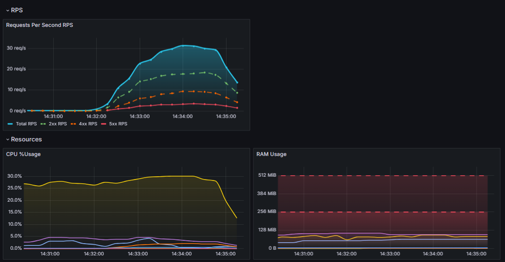

# VipService Technical Task

Веб-сервис с reverse-proxy, мониторингом и централизованным логированием. Полная автоматизация подготовки сервера и деплоя — одной командой Ansible.

---

## 📋 Описание

Проект разворачивает связку из 9 контейнеров в изолированной Docker-сети:

- **Backend** — HTTP-сервер `hashicorp/http-echo`, отвечает текстом *"pong"*
- **Nginx** — reverse-proxy, единственный публичный вход в приложение
- **Prometheus** — сбор метрик со всех экспортёров
- **Grafana** — веб-интерфейс для метрик и логов (дашборды и Explore)
- **nginx-prometheus-exporter** — метрики `stub_status` (соединения, запросы)
- **prometheus-nginxlog-exporter** — метрики access.log (статус-коды)
- **cadvisor** — CPU/RAM по контейнерам
- **Loki** — хранилище логов
- **Promtail** — агент доставки логов всех контейнеров в Loki

---

## 🚀 Запуск

### Требования

| Что | Зачем |
| :--- | :--- |
| Ubuntu 20.04+ | Целевая ОС плейбука |
| Ansible 2.10+ | Движок автоматизации |
| git | Клонирование репозитория |
| Права sudo | Установка Docker и системных пакетов |
| Интернет | Apt-репозиторий Docker, Docker Hub, gcr.io |

### Быстрый старт

```bash
# 1. Клонировать репозиторий
git clone https://github.com/asli213312/VipService-Technical-Task.git

cd VipService-Technical-Task

# 2. Установить Ansible (если не установлен)
sudo apt update && sudo apt install -y ansible git

# 3. Установить коллекции Ansible
ansible-galaxy collection install -r ansible/requirements.yml

# 4. Запустить деплой
ansible-playbook -i ./ansible/inventory.ini ./ansible/deploy.yml
```

### Проверка работы

```bash
Все 9 контейнеров Up (nginx, prometheus, grafana, cadvisor — healthy)

# Приложение через nginx
curl http://localhost/ping          # → pong

# Grafana: http://localhost:3000 (данные входа — в файле .env)
```

---

## 🧪 Тестирование

В папке `tests/` — bash-скрипты, генерирующие трафик для проверки мониторинга. После их запуска дашборды и панели в Grafana наполняются реальными данными.

### 1. Нагрузочный тест (RPS)

Генерирует плавный рост и спад RPS с разными HTTP-кодами.

```bash
./tests/test_create_mountain_rps.bash
```
### 2. Проверка Rate Limiter

Инициирует пакетный всплеск запросов для верификации Nginx rate-limiter'а и последующего анализа отклоненных (429) ответов.

```bash
./tests/test_rate_limit.bash
```

---

## 🏗 Архитектура

```
Пользователь
   │
   ├── :80 ────▶ Nginx ────▶ Backend                 (внутри сети "app")
   │
   └── :3000 ──▶ Grafana ──▶ Prometheus ──▶ nginx-exporter
                             │           ├─▶ nginxlog-exporter
                             │           └─▶ cadvisor
                             └─▶ Loki ◀─── Promtail   (логи всех контейнеров)
```

### Принцип изоляции

- Все сервисы объединены в собственную Docker-сеть `app` и общаются по DNS-именам.
- **Наружу проброшены только два порта:** `80` (Nginx) и `3000` (Grafana).
- Prometheus, экспортёры, cadvisor и Loki доступны только изнутри сети `app`.

---

## 📊 Мониторинг

Дашборды создаются автоматически через provisioning (без кликов в UI):

| Дашборд | Содержимое |
| :--- | :--- |
| **Backend Overview** | RPS, ошибки 5xx, CPU/RAM контейнеров |
| **Logs** | Логи backend и nginx |


---

## 📝 Логирование (Loki + Promtail)

| Источник | Как собирается |
| :--- | :--- |
| stdout/stderr **всех** контейнеров | `docker_sd_configs` (Docker socket, read-only) |
| access/error логи **Nginx** | `static_configs` (файлы из смонтированной директории) |

---

## 📁 Структура проекта

```
VipService-Technical-Task/
├── ansible/
│   ├── deploy.yml                 # entry-point плейбука
│   ├── inventory.ini              # localhost-инвентарь
│   ├── requirements.yml           # коллекции (community.docker)
│   ├── group_vars/all.yml         # версии образов, лимиты памяти
│   └── roles/
│       ├── common/                # базовые пакеты, deploy-пользователь
│       ├── docker/                # Docker из официального репозитория
│       └── deploy/                # копирование проекта, compose up, handlers
│           └── templates/
│               └── docker-compose.yml.j2   # единственный источник compose-файла
├── backend/                       # Dockerfile (http-echo)
├── nginx/                         # nginx.conf, Dockerfile, логи
├── prometheus/                    # prometheus.yml
├── grafana/                       # provisioning: dashboards + datasources
├── loki/                          # promtail.yml
├── .env                           # Данные входа в Grafana
└── README.md
```

> 📌 Compose-файл на сервере **рендерится из шаблона** `docker-compose.yml.j2` с переменными из `group_vars/all.yml` — это исключает рассинхрон версий между «файлом в репозитории» и «файлом на сервере».

---

## 🛠 Технологии

| Технология | Версия | Назначение |
| :--- | :--- | :--- |
| Docker / Compose v2 | 24+ / plugin | Контейнеризация и оркестрация |
| Ansible | 2.10+ | IaC-деплой |
| Nginx | 1.27.0-alpine | Reverse-proxy |
| hashicorp/http-echo | 1.0.0 | Backend |
| Prometheus | v2.53.0 | Метрики |
| Grafana | 11.1.0 | Визуализация |
| nginx-prometheus-exporter | 1.1.0 | stub_status |
| prometheus-nginxlog-exporter | v1.11.0 | access.log |
| cadvisor | v0.47.0 | Container metrics |
| Loki / Promtail | 3.4.2 | Централизованные логи |

---

## 🔄 Идемпотентность

| Сценарий | Поведение |
| :--- | :--- |
| Первый запуск | Установка Docker, копирование проекта, запуск контейнеров |
| Повторный без изменений | Задачи `ok`, контейнеры не пересоздаются |
| Изменена версия в `group_vars` | Пересоздаётся только затронутый сервис |
| Изменён конфиг nginx/prometheus | Handler `restart services` перезапускает стек |
| Сервис удалён из compose | `remove_orphans: true` убирает старый контейнер |
